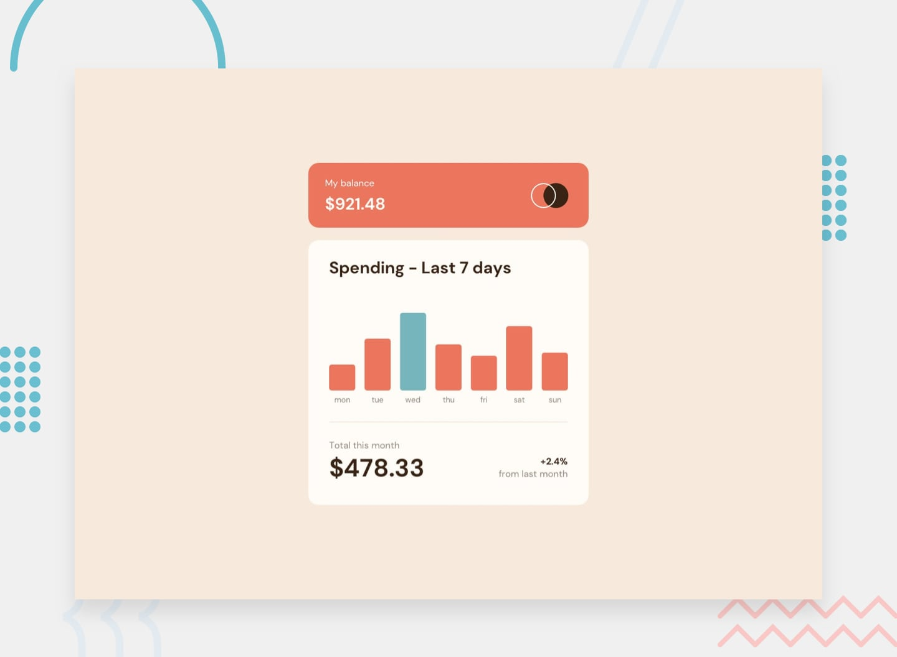

# Frontend Mentor - Expenses Chart Component



## 📌 Overview

This is a solution to the **Frontend Mentor - Expenses Chart Component** challenge. The goal of the challenge was to build out a responsive bar chart component and get it looking as close to the design as possible, using the provided `data.json` file for chart data.

##  Developed By

**Muskan Fatima**

---

## 🔨 Built With

- HTML5
- CSS3 (Flexbox & Media Queries)
- JavaScript (ES6+)
- Responsive Design Techniques
- Local `data.json` for dynamic rendering

---

## 💡 Features

- ✅ Dynamic bar chart based on `data.json`
- ✅ Highlights the current day's bar
- ✅ Tooltips showing the exact amount on hover
- ✅ Responsive layout for mobile and desktop
- ✅ Interactive hover states on all elements

---

## 📱 Responsive Preview

The layout adjusts based on screen size to ensure optimal readability and interaction on all devices.

---

## 🗂️ Project Structure

```
.
├── images/
├── design/
├── data.json
├── index.html
├── index.css
└── README.md
```

---

## 🚀 Getting Started

To run the project locally:

1. Clone the repository:
   ```bash
   git clone https://github.com/muskan-fatim/expenses-chart-component.git
   ```
2. Navigate to the folder:
   ```bash
   cd expenses-chart-component
   ```
3. Open `index.html` in your browser.

---

## 🌐 Live Site

Check out the live version here: **[Your Live Site Link](#)**

---

## 📝 What I Learned

- How to work with dynamic JSON data in a visual component
- Responsive design and layout structuring
- Creating smooth hover effects
- Managing real-time data display with JavaScript

---

## 🙌 Acknowledgements

This challenge was provided by [Frontend Mentor](https://www.frontendmentor.io). It's a great platform to practice building projects and improve front-end development skills.

---

## 📬 Feedback

If you have any feedback or suggestions, feel free to reach out on [LinkedIn](#) or open an issue in the repository.

---

**Thank you! 😊**

